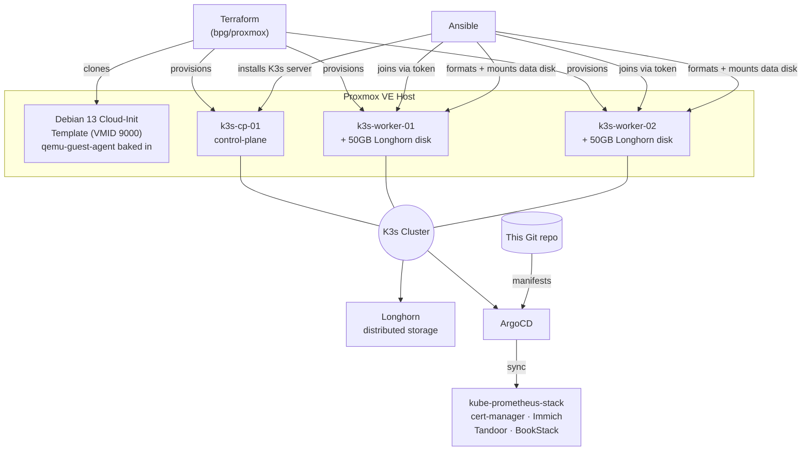

# Setup & Runbook

Full build log and replication guide for the homelab GitOps Kubernetes platform. See [`00-for-recruiters.md`](./00-for-recruiters.md) for the high-level pitch, and the root [`README.md`](../README.md) for the ongoing project roadmap.

This document reflects the actual build session end to end, including every bug that was hit and how it was fixed — replicating this from scratch should not require re-discovering any of them.

---

## Architecture



**Layers, bottom to top:**
1. **Terraform** (`terraform/proxmox/`) — provisions VMs on Proxmox via the `bpg/proxmox` provider, from a hand-built Cloud-Init template.
2. **Ansible** (`ansible/playbooks/`) — installs K3s itself, and prepares each worker's secondary disk for Longhorn.
3. **ArgoCD** (`kubernetes/`) — takes over cluster state from here; every application is a Git-committed `Application` manifest.

---

## Prerequisites

- A Proxmox VE host (this was built against 9.2.2) with API access
- Terraform >= 1.0
- **Ansible cannot run on native Windows** (it requires the Unix-only `fcntl` module). If your workstation is Windows, install Ansible inside WSL (`wsl --install`, then `sudo apt install ansible` inside the WSL distro) — this is what was used to build this.
- An SSH key pair for VM access
- `kubectl` (can also just be run from the K3s control-plane node itself, which K3s installs it on automatically)

---

## Step-by-step replication

### 1. Create a Proxmox API token

Datacenter → Permissions → API Tokens → Add. **Uncheck "Privilege Separation"** unless you plan to explicitly grant permissions afterward (see [Troubleshooting](#bugs-hit-and-fixed) below — a Privilege-Separated token silently returns empty lists instead of erroring, which is a confusing failure mode).

If you do use Privilege Separation, grant it at minimum:
`VM.Allocate`, `VM.Clone`, `VM.Config.*`, `VM.PowerMgmt`, `VM.Monitor`, `Datastore.Audit`, `Datastore.AllocateSpace` on path `/`.

### 2. Build the Cloud-Init template

Run **on the Proxmox host itself** (not from your workstation):

```bash
scp terraform/proxmox/create-cloudinit-template.sh root@<proxmox-host>:/root/
ssh root@<proxmox-host> 'bash /root/create-cloudinit-template.sh'
```

This downloads the Debian 13 (trixie) generic cloud image, uses `virt-customize` to bake in and enable `qemu-guest-agent` **before** the image is ever imported into Proxmox, then converts it to template VMID `9000`. See [why this step exists](#bugs-hit-and-fixed) below.

### 3. Configure Terraform

```bash
cd terraform/proxmox
cp terraform.tfvars.example terraform.tfvars
# edit terraform.tfvars: real API URL (include :8006!), token, node name, SSH key path
```

The `vms` map defines your cluster topology — one `control-plane` entry, N `worker` entries, each with its own `template_vm_id`, sizing, and optional `secondary_disk_size` for Longhorn (workers only).

If you have **pre-existing VMs on the same Proxmox host that Terraform should not manage**, do not add them to the `vms` map, and if they were ever imported into a previous state, remove them: `terraform state rm '<resource address>'` (this only edits local state — it does not touch the live VM).

### 4. Provision the VMs

```bash
terraform init
terraform plan   # review carefully - confirm 0 unexpected destroys
terraform apply
```

### 5. Bootstrap K3s

From WSL (or any Linux control node):

```bash
cd ansible
ansible-playbook -i inventories/production/hosts.ini playbooks/install-k3s.yml
```

This installs the K3s server on the control-plane, retrieves its join token, and joins both workers as agents. Verify:

```bash
ssh matt@<control-plane-ip> 'sudo kubectl get nodes'
```

### 6. Prepare Longhorn storage

```bash
ansible-playbook -i inventories/production/hosts.ini playbooks/setup-longhorn-nodes.yml
```

Installs `open-iscsi`/`nfs-common`, formats the secondary disk `ext4`, mounts it at `/var/lib/longhorn`. The disk is identified **structurally** (the one block device with no partition table), not by a hardcoded device name — see [why](#bugs-hit-and-fixed) below.

### 7. Bootstrap ArgoCD

```bash
scp kubernetes/bootstrap/install-argocd.sh matt@<control-plane-ip>:/tmp/
ssh matt@<control-plane-ip> 'sudo KUBECONFIG=/etc/rancher/k3s/k3s.yaml bash /tmp/install-argocd.sh'
```

Prints the initial admin password retrieval command at the end. Log in, then delete `argocd-initial-admin-secret` as recommended upstream.

### 8. Install Longhorn and deploy the first apps

```bash
# Longhorn itself (Helm)
helm repo add longhorn https://charts.longhorn.io && helm repo update
kubectl create namespace longhorn-system
helm install longhorn longhorn/longhorn \
  --namespace longhorn-system \
  --set defaultSettings.defaultDataPath="/var/lib/longhorn" \
  --set defaultSettings.createDefaultDiskLabeledNodes=true
kubectl label nodes <worker-1> <worker-2> node.longhorn.io/create-default-disk=true

# ArgoCD apps - first sync of each is a manual kubectl apply (no App-of-Apps yet)
kubectl apply -f kubernetes/apps/kube-prometheus-stack.yaml
kubectl apply -f kubernetes/apps/cert-manager.yaml
# wait for cert-manager to be Ready, THEN:
kubectl apply -f kubernetes/apps/cluster-issuers.yaml   # edit the email placeholder first
kubectl apply -f kubernetes/apps/immich.yaml             # edit domain + create the postgres secret first
kubectl apply -f kubernetes/apps/tandoor.yaml
kubectl apply -f kubernetes/apps/bookstack.yaml
```

Every one of these `.yaml` files has `TODO`-flagged placeholders (domains, the Let's Encrypt contact email, database secrets) — check each file before applying.

---

## Bugs hit and fixed

Documented in detail because they're the actual engineering content of this build, not because anything went "wrong." In order encountered:

### 1. `terraform apply` hangs indefinitely on VM creation
**Cause:** the Debian cloud image does not ship `qemu-guest-agent`. The Terraform module sets `agent { enabled = true }`, so the provider waits (up to `agent.timeout`) for a guest-agent response that never comes.
**Fix:** `create-cloudinit-template.sh` now runs `virt-customize -a <image> --install qemu-guest-agent --run-command 'systemctl enable qemu-guest-agent'` on the image **before** it's imported into Proxmox — via `libguestfs-tools`, with `LIBGUESTFS_BACKEND=direct` (Proxmox hosts don't run `libvirtd` by default, which `virt-customize` otherwise tries first).

### 2. `terraform destroy` *also* hangs, on VMs from the broken template
**Cause:** Terraform refreshes state before any operation, including destroy — and that refresh hits the same non-responsive guest-agent problem for any resource with `agent.enabled = true`.
**Fix:** for VMs you don't need Terraform to gracefully tear down, skip the state refresh entirely: `terraform state rm '<address>'` (removes from state only), then delete the VM directly (`qm stop <vmid> && qm destroy <vmid> --purge` on the Proxmox host).

### 3. Proxmox API returns empty VM/storage lists despite VMs existing
**Cause:** an API token created with **Privilege Separation** enabled doesn't inherit the owning user's permissions and has none of its own by default. List-type endpoints (`/qemu`, `/lxc`, `/storage`) silently filter to empty instead of erroring; only a more specific endpoint (e.g. storage *content*) surfaces an explicit 403.
**Fix:** grant the token an explicit role (e.g. `Administrator`) on path `/` via Datacenter → Permissions → Add → API Token Permission, or recreate the token without Privilege Separation.

### 4. `terraform apply` fails on worker nodes only: `unsupported format 'qcow2'`
**Cause:** the module's secondary (Longhorn) disk block didn't set `file_format`. The provider's default for a freshly-created (non-cloned) disk is `qcow2`, but `local-lvm` (LVM-Thin) is block storage and only supports `raw`.
**Fix:** explicit `file_format = "raw"` on the secondary `disk` block in `modules/ubuntu-vm/main.tf`. The primary (cloned) disk was never affected — clones inherit their source's format.

### 5. Near-miss: `/dev/sdb` is the wrong disk on one worker
**Cause:** Linux device naming for multiple SCSI/virtio disks is not guaranteed to match attachment order across every boot. On one worker, the blank 50GB Longhorn disk enumerated as `/dev/sda` while the cloned, mounted **root** filesystem enumerated as `/dev/sdb` — the exact opposite of the other worker and of the hardcoded assumption in the first version of `setup-longhorn-nodes.yml`.
**What happened:** `mkfs.ext4`'s own safety check refused to format a disk it detected as in-use, with `/dev/sdb is apparently in use by the system; will not make a filesystem here!` — this is what prevented the root filesystem from being wiped. It was not a check written into the playbook; it was a lucky backstop from `mke2fs` itself.
**Fix:** the playbook no longer trusts a device name. It inspects `ansible_devices`, finds whichever `sdX` device has an **empty partition table**, and asserts that exactly one such candidate exists before doing anything — the cloned root disk always has partitions (from the template), a fresh Terraform-attached disk never does. Structural identification instead of positional assumption.

### 6. Ansible can't run on the Windows workstation at all
**Cause:** Ansible's control-node code depends on `fcntl`, a POSIX-only Python stdlib module with no Windows equivalent — no `pip install` fixes this.
**Fix:** ran Ansible from WSL (Windows Subsystem for Linux) instead, with the SSH private key copied into WSL's native filesystem (not accessed via `/mnt/c/...`, which has Windows-permissive file permissions that OpenSSH refuses for a private key — `chmod 600` inside WSL's own filesystem fixes this).

### 7. Ansible fails with `Attempting to decrypt but no vault secrets found`
**Cause:** running `ansible-playbook` from inside the `ansible/` directory causes Ansible to auto-discover and try to decrypt `group_vars/all/vault.yml` — which belongs to this repo's separate Docker/reverse-proxy track and has nothing to do with the K3s inventory being run, but is still unconditionally loaded for any host in group `all`.
**Fix:** run `ansible-playbook` from a working directory outside the `ansible/` tree, passing full paths to both the inventory and the playbook — this avoids the cwd-relative `group_vars/` auto-discovery that pulls in the unrelated vault file.

### 8. ArgoCD install fails: CRD annotation too large
**Cause:** a plain `kubectl apply -f <upstream ArgoCD manifests>` stores the entire object as a `last-applied-configuration` annotation for future 3-way merges. ArgoCD's `applicationsets.argoproj.io` CRD has a large enough OpenAPI schema to exceed Kubernetes' 256KiB (262144 byte) annotation size limit.
**Fix:** `kubectl apply --server-side` — server-side apply has the API server compute the diff instead of relying on a client-stored annotation, so the size limit doesn't apply.

### 9. Re-running the (now server-side) apply hits field-manager conflicts
**Cause:** the first, partially-failed run had already created most objects via client-side apply, registering `kubectl-client-side-apply` as their field manager. The second, server-side run then conflicted with that ownership on fields already set.
**Fix:** added `--force-conflicts` — safe here since nothing else manages these fields; documented in the [Kubernetes server-side apply docs](https://kubernetes.io/docs/reference/using-api/server-side-apply/#conflicts).

---

## Known limitations / what's next

Tracked as an ongoing checklist in the root [`README.md`](../README.md#phase-6-production-hardening--gitops-maturity-next-steps) (Phase 6) — App-of-Apps automation, remote Terraform state, Longhorn backup target, GitOps secrets management, CI validation, Alertmanager receivers, and Ingress/TLS routing decisions all remain open.
