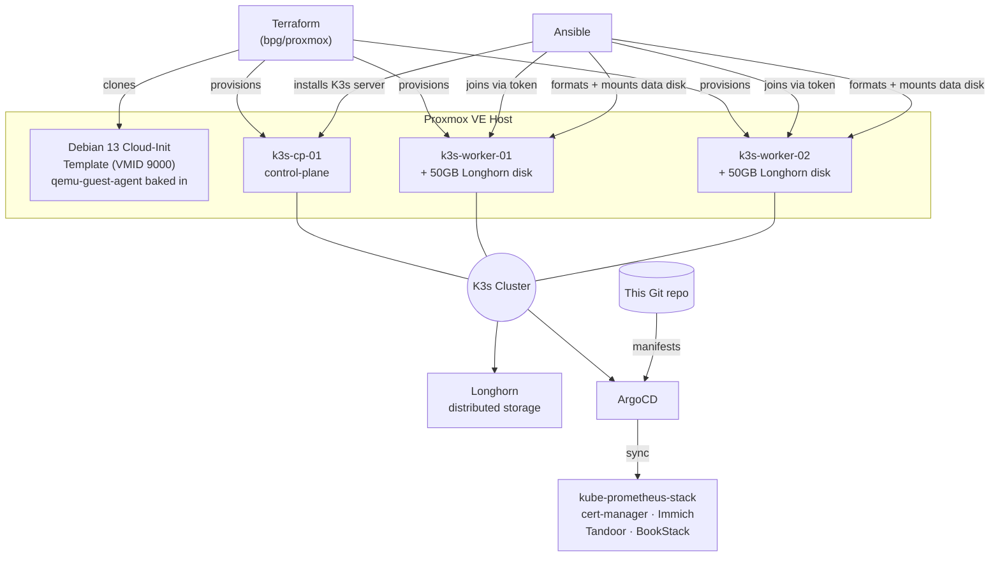

# Setup & Runbook

Full build log and replication guide for the homelab GitOps Kubernetes platform. See [`00-for-recruiters.md`](./00-for-recruiters.md) for the high-level pitch, and the root [`README.md`](../README.md) for the ongoing project roadmap.

This document reflects the actual build session end to end, including every bug that was hit and how it was fixed — replicating this from scratch should not require re-discovering any of them.

---

## Architecture



**Layers, bottom to top:**
1. **Terraform** (`terraform/proxmox/`) — provisions VMs on Proxmox via the `bpg/proxmox` provider, from a hand-built Cloud-Init template.
2. **Ansible** (`ansible/playbooks/`) — installs K3s itself, and prepares each worker's secondary disk for Longhorn.
3. **ArgoCD** (`kubernetes/`) — takes over cluster state from here; every application is a Git-committed `Application` manifest.

---

## Prerequisites

- A Proxmox VE host (this was built against 9.2.2) with API access
- Terraform >= 1.0
- **Ansible cannot run on native Windows** (it requires the Unix-only `fcntl` module). If your workstation is Windows, install Ansible inside WSL (`wsl --install`, then `sudo apt install ansible` inside the WSL distro) — this is what was used to build this.
- An SSH key pair for VM access
- `kubectl` (can also just be run from the K3s control-plane node itself, which K3s installs it on automatically)

---

## Step-by-step replication

### 1. Create a Proxmox API token

Datacenter → Permissions → API Tokens → Add. **Uncheck "Privilege Separation"** unless you plan to explicitly grant permissions afterward (see [Troubleshooting](#bugs-hit-and-fixed) below — a Privilege-Separated token silently returns empty lists instead of erroring, which is a confusing failure mode).

If you do use Privilege Separation, grant it at minimum:
`VM.Allocate`, `VM.Clone`, `VM.Config.*`, `VM.PowerMgmt`, `VM.Monitor`, `Datastore.Audit`, `Datastore.AllocateSpace` on path `/`.

### 2. Build the Cloud-Init template

Run **on the Proxmox host itself** (not from your workstation):

```bash
scp terraform/proxmox/create-cloudinit-template.sh root@<proxmox-host>:/root/
ssh root@<proxmox-host> 'bash /root/create-cloudinit-template.sh'
```

This downloads the Debian 13 (trixie) generic cloud image, uses `virt-customize` to bake in and enable `qemu-guest-agent` **before** the image is ever imported into Proxmox, then converts it to template VMID `9000`. See [why this step exists](#bugs-hit-and-fixed) below.

### 3. Configure Terraform

```bash
cd terraform/proxmox
cp terraform.tfvars.example terraform.tfvars
# edit terraform.tfvars: real API URL (include :8006!), token, node name, SSH key path
```

The `vms` map defines your cluster topology — one `control-plane` entry, N `worker` entries, each with its own `template_vm_id`, sizing, and optional `secondary_disk_size` for Longhorn (workers only).

If you have **pre-existing VMs on the same Proxmox host that Terraform should not manage**, do not add them to the `vms` map, and if they were ever imported into a previous state, remove them: `terraform state rm '<resource address>'` (this only edits local state — it does not touch the live VM).

### 4. Provision the VMs

```bash
terraform init
terraform plan   # review carefully - confirm 0 unexpected destroys
terraform apply
```

### 5. Bootstrap K3s

From WSL (or any Linux control node):

```bash
cd ansible
ansible-playbook -i inventories/production/hosts.ini playbooks/install-k3s.yml
```

This installs the K3s server on the control-plane, retrieves its join token, and joins both workers as agents. Verify:

```bash
ssh matt@<control-plane-ip> 'sudo kubectl get nodes'
```

### 6. Prepare Longhorn storage

```bash
ansible-playbook -i inventories/production/hosts.ini playbooks/setup-longhorn-nodes.yml
```

Two plays: iSCSI/NFS OS prerequisites go on **every** cluster node (`k3s_cluster`) including the control-plane - Longhorn's manager DaemonSet needs `iscsiadm` there too even though it holds no disk, see [bug 10](#bugs-hit-and-fixed) below. Only then does the second play format the secondary disk `ext4` and mount it at `/var/lib/longhorn` on the workers. The disk is identified **structurally** (the one block device with no partition table), not by a hardcoded device name — see [bug 5](#bugs-hit-and-fixed) below.

### 7. Bootstrap ArgoCD

```bash
scp kubernetes/bootstrap/install-argocd.sh matt@<control-plane-ip>:/tmp/
ssh matt@<control-plane-ip> 'sudo KUBECONFIG=/etc/rancher/k3s/k3s.yaml bash /tmp/install-argocd.sh'
```

Prints the initial admin password retrieval command at the end. Log in, then delete `argocd-initial-admin-secret` as recommended upstream.

### 8. Install Longhorn and deploy the first apps

```bash
# Longhorn itself (Helm)
helm repo add longhorn https://charts.longhorn.io && helm repo update
kubectl create namespace longhorn-system
helm install longhorn longhorn/longhorn \
  --namespace longhorn-system \
  --set defaultSettings.defaultDataPath="/var/lib/longhorn" \
  --set defaultSettings.createDefaultDiskLabeledNodes=true \
  --set persistence.defaultClassReplicaCount=<number of worker/storage nodes>
kubectl label nodes <worker-1> <worker-2> node.longhorn.io/create-default-disk=true
```

Set `persistence.defaultClassReplicaCount` to however many nodes actually have a Longhorn disk (2 in this build) - the chart's own default is 3, which silently deadlocks every volume if you have fewer storage nodes than that. See [bug 12](#bugs-hit-and-fixed) below.

Also reduce each disk's reserved buffer - Longhorn reserves ~30% of a disk by default, sized for disks *shared* with other workloads. Ours are 100% dedicated to Longhorn, so that reservation just wastes capacity and can block volumes from scheduling at all (see [bug 13](#bugs-hit-and-fixed)):

```bash
for n in <worker-1> <worker-2>; do
  disk=$(kubectl -n longhorn-system get nodes.longhorn.io "$n" -o jsonpath='{.spec.disks}' | python3 -c "import json,sys; print(list(json.load(sys.stdin).keys())[0])")
  kubectl -n longhorn-system patch nodes.longhorn.io "$n" --type=merge \
    -p "{\"spec\":{\"disks\":{\"$disk\":{\"storageReserved\":2147483648}}}}"   # 2GiB
done
```

```bash
# kube-prometheus-stack's CRDs live in Helm's special crds/ folder, which
# ArgoCD does not reliably manage even with ServerSideApply=true (see bug
# 11) - kubernetes/apps/kube-prometheus-stack.yaml already sets
# source.helm.skipCrds: true to opt out of ArgoCD managing them, so install
# them once yourself, version-matched to the pinned chart revision:
helm repo add prometheus-community https://prometheus-community.github.io/helm-charts
helm repo update
helm show crds prometheus-community/kube-prometheus-stack --version 65.5.1 \
  | kubectl apply --server-side -f -

# ArgoCD apps - first sync of each is a manual kubectl apply (no App-of-Apps yet)
kubectl apply -f kubernetes/apps/kube-prometheus-stack.yaml
kubectl apply -f kubernetes/apps/cert-manager.yaml
# wait for cert-manager to be Ready, THEN:
kubectl apply -f kubernetes/apps/cluster-issuers.yaml   # edit the email placeholder first
kubectl apply -f kubernetes/apps/immich-postgres.yaml     # standalone Postgres+Redis - see bugs 17/18 below
kubectl apply -f kubernetes/apps/immich.yaml               # edit domain + create the postgres secret first
kubectl apply -f kubernetes/apps/tandoor.yaml
kubectl apply -f kubernetes/apps/bookstack.yaml
```

Every one of these `.yaml` files has `TODO`-flagged placeholders (domains, the Let's Encrypt contact email, database secrets) — check each file before applying.

Access Grafana without any ingress/TLS setup at all, straight over a port-forward:

```bash
kubectl port-forward svc/kube-prometheus-stack-grafana 3000:80 -n monitoring
# http://localhost:3000, user: admin, password:
kubectl -n monitoring get secret kube-prometheus-stack-grafana -o jsonpath='{.data.admin-password}' | base64 -d
```

---

## Bugs hit and fixed

Documented in detail because they're the actual engineering content of this build, not because anything went "wrong." In order encountered:

### 1. `terraform apply` hangs indefinitely on VM creation
**Cause:** the Debian cloud image does not ship `qemu-guest-agent`. The Terraform module sets `agent { enabled = true }`, so the provider waits (up to `agent.timeout`) for a guest-agent response that never comes.
**Fix:** `create-cloudinit-template.sh` now runs `virt-customize -a <image> --install qemu-guest-agent --run-command 'systemctl enable qemu-guest-agent'` on the image **before** it's imported into Proxmox — via `libguestfs-tools`, with `LIBGUESTFS_BACKEND=direct` (Proxmox hosts don't run `libvirtd` by default, which `virt-customize` otherwise tries first).

### 2. `terraform destroy` *also* hangs, on VMs from the broken template
**Cause:** Terraform refreshes state before any operation, including destroy — and that refresh hits the same non-responsive guest-agent problem for any resource with `agent.enabled = true`.
**Fix:** for VMs you don't need Terraform to gracefully tear down, skip the state refresh entirely: `terraform state rm '<address>'` (removes from state only), then delete the VM directly (`qm stop <vmid> && qm destroy <vmid> --purge` on the Proxmox host).

### 3. Proxmox API returns empty VM/storage lists despite VMs existing
**Cause:** an API token created with **Privilege Separation** enabled doesn't inherit the owning user's permissions and has none of its own by default. List-type endpoints (`/qemu`, `/lxc`, `/storage`) silently filter to empty instead of erroring; only a more specific endpoint (e.g. storage *content*) surfaces an explicit 403.
**Fix:** grant the token an explicit role (e.g. `Administrator`) on path `/` via Datacenter → Permissions → Add → API Token Permission, or recreate the token without Privilege Separation.

### 4. `terraform apply` fails on worker nodes only: `unsupported format 'qcow2'`
**Cause:** the module's secondary (Longhorn) disk block didn't set `file_format`. The provider's default for a freshly-created (non-cloned) disk is `qcow2`, but `local-lvm` (LVM-Thin) is block storage and only supports `raw`.
**Fix:** explicit `file_format = "raw"` on the secondary `disk` block in `modules/ubuntu-vm/main.tf`. The primary (cloned) disk was never affected — clones inherit their source's format.

### 5. Near-miss: `/dev/sdb` is the wrong disk on one worker
**Cause:** Linux device naming for multiple SCSI/virtio disks is not guaranteed to match attachment order across every boot. On one worker, the blank 50GB Longhorn disk enumerated as `/dev/sda` while the cloned, mounted **root** filesystem enumerated as `/dev/sdb` — the exact opposite of the other worker and of the hardcoded assumption in the first version of `setup-longhorn-nodes.yml`.
**What happened:** `mkfs.ext4`'s own safety check refused to format a disk it detected as in-use, with `/dev/sdb is apparently in use by the system; will not make a filesystem here!` — this is what prevented the root filesystem from being wiped. It was not a check written into the playbook; it was a lucky backstop from `mke2fs` itself.
**Fix:** the playbook no longer trusts a device name. It inspects `ansible_devices`, finds whichever `sdX` device has an **empty partition table**, and asserts that exactly one such candidate exists before doing anything — the cloned root disk always has partitions (from the template), a fresh Terraform-attached disk never does. Structural identification instead of positional assumption.

### 6. Ansible can't run on the Windows workstation at all
**Cause:** Ansible's control-node code depends on `fcntl`, a POSIX-only Python stdlib module with no Windows equivalent — no `pip install` fixes this.
**Fix:** ran Ansible from WSL (Windows Subsystem for Linux) instead, with the SSH private key copied into WSL's native filesystem (not accessed via `/mnt/c/...`, which has Windows-permissive file permissions that OpenSSH refuses for a private key — `chmod 600` inside WSL's own filesystem fixes this).

### 7. Ansible fails with `Attempting to decrypt but no vault secrets found`
**Cause:** running `ansible-playbook` from inside the `ansible/` directory causes Ansible to auto-discover and try to decrypt `group_vars/all/vault.yml` — which belongs to this repo's separate Docker/reverse-proxy track and has nothing to do with the K3s inventory being run, but is still unconditionally loaded for any host in group `all`.
**Fix:** run `ansible-playbook` from a working directory outside the `ansible/` tree, passing full paths to both the inventory and the playbook — this avoids the cwd-relative `group_vars/` auto-discovery that pulls in the unrelated vault file.

### 8. ArgoCD install fails: CRD annotation too large
**Cause:** a plain `kubectl apply -f <upstream ArgoCD manifests>` stores the entire object as a `last-applied-configuration` annotation for future 3-way merges. ArgoCD's `applicationsets.argoproj.io` CRD has a large enough OpenAPI schema to exceed Kubernetes' 256KiB (262144 byte) annotation size limit.
**Fix:** `kubectl apply --server-side` — server-side apply has the API server compute the diff instead of relying on a client-stored annotation, so the size limit doesn't apply.

### 9. Re-running the (now server-side) apply hits field-manager conflicts
**Cause:** the first, partially-failed run had already created most objects via client-side apply, registering `kubectl-client-side-apply` as their field manager. The second, server-side run then conflicted with that ownership on fields already set.
**Fix:** added `--force-conflicts` — safe here since nothing else manages these fields; documented in the [Kubernetes server-side apply docs](https://kubernetes.io/docs/reference/using-api/server-side-apply/#conflicts).

### 10. `longhorn-manager` CrashLoopBackOff on the control-plane
**Cause:** Longhorn's manager runs as a DaemonSet on *every* cluster node, including the control-plane - even though the control-plane holds no Longhorn disk by design (see Terraform's `secondary_disk_size`, worker-only). `setup-longhorn-nodes.yml` originally only targeted `workers`, so the control-plane never got `open-iscsi` installed. The manager's own startup check fails hard without it: `Error starting manager: failed to check environment, please make sure you have iscsiadm/open-iscsi installed on the host`.
**Fix:** split the playbook into two plays - iSCSI/NFS OS prerequisites now run against `k3s_cluster` (all nodes), while the disk format/mount logic stays `workers`-only.

### 11. ArgoCD sync fails on kube-prometheus-stack: same CRD-annotation-size problem, in a new place
**Cause:** ArgoCD's Helm rendering *does* attempt to apply CRDs from a chart's special `crds/` folder (it isn't skipped outright), but does so in a way that hits the identical 256KiB annotation limit from bug 8/9 - and unlike ArgoCD's own bootstrap, setting `syncOptions: [ServerSideApply=true]` at the Application level did **not** fix it here; the same "Too long" error kept recurring across multiple sync retries.
**Fix:** `source.helm.skipCrds: true` on the Application, so ArgoCD doesn't touch these CRDs at all - install them once yourself, version-matched to the pinned chart revision: `helm show crds prometheus-community/kube-prometheus-stack --version <rev> | kubectl apply --server-side -f -`. After changing this on an Application that's already stuck retrying, a `kubectl delete -f` + `kubectl apply -f` (full recreate) was needed - a `refresh=hard` annotation and even clearing `status.operationState` were not enough to unstick the retry loop.

### 12. Prometheus/Alertmanager/Grafana volumes stuck `degraded`/`faulted`: replica count vs. actual storage nodes
**Cause:** the `longhorn` StorageClass's chart default is `numberOfReplicas: "3"`, but only 2 nodes in this cluster actually have a Longhorn disk (the control-plane deliberately has none). A 3rd replica can never be scheduled, so every volume sits permanently `degraded` - or, if it never got even one replica placed before something else went wrong, `faulted` and stuck `detached`.
**Fix:** `helm upgrade longhorn longhorn/longhorn --reuse-values --set persistence.defaultClassReplicaCount=2` fixes it for *new* volumes (`StorageClass.parameters` is immutable, so this recreates the class rather than patching it). Volumes already created against the old 3-replica class needed a direct, live patch - Longhorn supports changing replica count on an existing volume without recreating it: `kubectl -n longhorn-system patch volumes.longhorn.io <name> --type=merge -p '{"spec":{"numberOfReplicas":2}}'`.

### 13. A volume still won't schedule even at the correct replica count: `insufficient storage`
**Cause:** Longhorn reserves roughly 30% of every disk as unusable buffer by default (`storageReserved` on the node's disk spec) - sensible on a disk shared with other workloads, but our secondary disk exists *solely* for Longhorn. After Grafana's and Alertmanager's replicas were already scheduled, the remaining "usable" space (post-reservation) on a 50GB disk was just under Prometheus's 20Gi request.
**Fix:** reduced the reservation to a flat 2GiB per disk: `kubectl -n longhorn-system patch nodes.longhorn.io <node> --type=merge -p '{"spec":{"disks":{"<disk-name>":{"storageReserved":2147483648}}}}'`.

### 14. Deleting and recreating a stuck PVC deadlocks with itself
**Cause:** while recovering from bug 12/13, a faulted Prometheus PVC was deleted so the StatefulSet would recreate it fresh. Kubernetes' built-in `kubernetes.io/pvc-protection` finalizer blocks a PVC's deletion until no Pod references it - but the StatefulSet immediately created a *new* pod requesting a PVC with the exact same name, which then itself became the reference blocking the old PVC's finalizer from clearing. Neither side could proceed.
**Fix:** delete the new pod too (`--force --grace-period=0`) to drop the reference, let the finalizer clear and the old PVC fully disappear, and only then does the StatefulSet's next pod get a genuinely new PVC bound against the (by-then-corrected) StorageClass.

### 15. A routine memory bump plans to destroy and recreate all 3 VMs
**Cause:** `ssh_keys = [file(var.ssh_public_key_path)]` in `main.tf` reads the key file byte-for-byte. At some point the file's trailing newline no longer matched what was captured in state, and `user_account.keys` is only appliable at clone time - so Terraform planned a full destroy+recreate of every VM (including their Longhorn disks) just to change a value that looked character-for-character identical when printed.
**Fix:** wrap it in `trimspace()`: `ssh_keys = [trimspace(file(var.ssh_public_key_path))]`. This was latent and would have bitten the *next* `terraform apply` regardless of what it changed - not specific to the memory change that surfaced it.

### 16. Resizing a live-attached disk reshuffles device names mid-session
**Cause:** growing a worker's secondary disk via `terraform apply` (`secondary_disk_size: 50 -> 500`) caused the guest kernel to re-enumerate its SCSI devices on that one worker - `/dev/sda` and `/dev/sdb` swapped roles between the disk being resized and the (unrelated) root disk, *while the system stayed running*. This is the same non-deterministic-naming issue as bug 5, but this time triggered by a live hardware change instead of a boot, and `/etc/fstab` (written with a device path, not a UUID) silently mounted nothing at `/var/lib/longhorn` on restart of the mount (`nofail` swallows the error).
**What happened:** Longhorn's own UUID check caught it - `record diskUUID doesn't match the one on the disk` - and marked the disk `Ready: False` rather than accepting the wrong filesystem. Several volumes went `degraded` (one remaining good replica) until the disk was fixed and Longhorn rebuilt the missing replica.
**Fix:** stop using device paths in `/etc/fstab` entirely. Resolve the filesystem's UUID (`blkid -s UUID -o value /dev/sdX`) and mount by `UUID=...` instead, on both workers - immune to enumeration order changing again for any reason.

### 17. Immich's bundled Postgres subchart doesn't just warn, it refuses to render
**Cause:** `postgresql.enabled: true` on the immich-charts chart is deprecated - but unlike a normal deprecation, the chart's `checks.yaml` template contains a hard `fail`, so `helm template` errors out completely (ArgoCD shows `ComparisonError`, not a warning) the moment that flag is set. See [immich-charts#149](https://github.com/immich-app/immich-charts/issues/149).
**Fix:** `postgresql.enabled` left at its default (`false`, i.e. the whole `postgresql:` block removed from values), and a standalone Postgres deployed instead - same `tensorchord/pgvecto-rs` pgvector-capable image the deprecated subchart used, as plain `StatefulSet` + `PVC` + `Service` manifests (`kubernetes/apps/manifests/immich-postgres/postgres.yaml`), with the required `cube`/`earthdistance`/`vectors` extensions created via a mounted `/docker-entrypoint-initdb.d` init script. Immich's shared `env.DB_HOSTNAME` etc. point at it; `DB_PASSWORD` arrives via `server.envFrom.secretRef` rather than being inlined in values.

### 18. Immich's bundled Redis subchart: image tag doesn't exist
**Cause:** the chart's `redis` subchart pulls `docker.io/bitnami/redis:7.2.5-debian-12-r0`, which Docker Hub returns `not found` for - Bitnami removed a large number of free-tier image tags in 2025 while moving to a paid "Secure Images" model. This breaks any chart still pinned to an affected tag, not something specific to this repo.
**Fix:** same pattern as Postgres - `redis.enabled` left at its default `false`, and a plain `redis:7-alpine` `StatefulSet` + `Service` deployed standalone (same manifests directory as the Postgres fix above), with `env.REDIS_HOSTNAME` pointed at it.

### 19. A GitOps Application can reference files that were never pushed
**Cause:** `kubernetes/apps/immich-postgres.yaml` was created and applied locally, but its `source.repoURL` points at GitHub, not the local filesystem - ArgoCD's own copy of the repo didn't have the new `manifests/immich-postgres/` directory yet, so the Application sat in `Unknown` sync status with `app path does not exist` until the commit was actually pushed.
**Not really a bug** - a reminder that with a git-hosted `source`, "I wrote the file" and "ArgoCD can see the file" are two different things. `kubectl apply`-ing an Application manifest only registers *that ArgoCD should watch a path* - it doesn't substitute for pushing what's supposed to be at that path.

### 20. A `secretRef` in `envFrom` silently loses to a chart's own default env value
**Cause:** the immich-charts chart's own default `values.yaml` already defines `env.DB_PASSWORD` as a template string (falling back to the literal placeholder `"immich"` once the deprecated postgres subchart's values were removed). Kubernetes resolves a container's `env` list and `envFrom` sources independently, and for a duplicate key, a plain `env` entry always wins over anything injected via `envFrom` - so `server.envFrom: [{secretRef: {name: immich-postgres-secret}}]` compiled correctly, but its `DB_PASSWORD` was silently shadowed by the chart's own baked-in one. Immich's actual Postgres password never matched what the server tried to authenticate with. `kubectl get pod ... -o jsonpath='{.spec.containers[0].env}'` was what surfaced it - the container's *rendered* env list showed the literal string `"immich"`, not a secret reference.
**Fix:** override the exact same `env.DB_PASSWORD` values path directly (not via `envFrom`), using the chart's support for structured env entries: `env.DB_PASSWORD.valueFrom.secretKeyRef`. Setting a value at the identical path a chart default occupies replaces it outright during the Helm values merge, instead of trying to out-compete it at the Kubernetes container-spec level.

### 21. `prune: true` deletes a Secret the moment it's removed from git - even ones with real data
**Cause:** `tandoor.yaml`/`bookstack.yaml` originally defined their Secret objects inline (with `CHANGE-ME` placeholders) and were pushed to git in an earlier session, so ArgoCD's first-ever sync created and *took ownership of* those Secrets. Later in this session the Secret blocks were removed from the manifests (in favor of creating them out-of-band, matching immich's pattern) - but the already-running Postgres/MariaDB pods still had the old placeholder credentials baked into their environment (and, for the databases, into their actual user tables on disk). The moment the removal was pushed and ArgoCD resynced, `prune: true` correctly saw "this Secret is no longer declared in git" and deleted it - taking down every *new* pod that needed it (already-running pods kept working, since env vars are injected once at container start and don't change when the Secret disappears later).
**Fix:** recovered the actual in-use values from the still-running pods' live environment (`kubectl exec <pod> -- env`) and recreated the Secrets with those exact values - a fresh random password would have been rejected by the already-initialized database. Lesson for next time: moving a resource from git-managed to out-of-band is not a no-op if ArgoCD already owns a version of it with real, live-depended-upon data - recreate it with matching values *before* or immediately as part of the same push that stops declaring it, not after.

### 22. Every rollout of a single-replica app on a ReadWriteOnce volume deadlocks
**Cause:** `Deployment`'s default `RollingUpdate` strategy schedules the new pod before terminating the old one. With `replicas: 1` and the app's PVCs mode `ReadWriteOnce`, the new pod can never actually start - `Multi-Attach error for volume ...: Volume is already used by pod(s) <old-pod>` - and since Kubernetes won't kill the old pod until the new one is Ready, neither side can proceed without manual intervention (delete the stuck new pod). This applies to Tandoor and BookStack; it would apply to any future single-replica app with RWO storage added the same way.
**Fix:** `strategy: {type: Recreate}` on both Deployments - explicitly stop the old pod (and release its volumes) before starting the new one, trading a few seconds of downtime per rollout for a rollout that doesn't hang.

---

## Known limitations / what's next

Tracked as an ongoing checklist in the root [`README.md`](../README.md#phase-6-production-hardening--gitops-maturity-next-steps) (Phase 6) — App-of-Apps automation, remote Terraform state, Longhorn backup target, GitOps secrets management, CI validation, Alertmanager receivers, and Ingress/TLS routing decisions all remain open.
