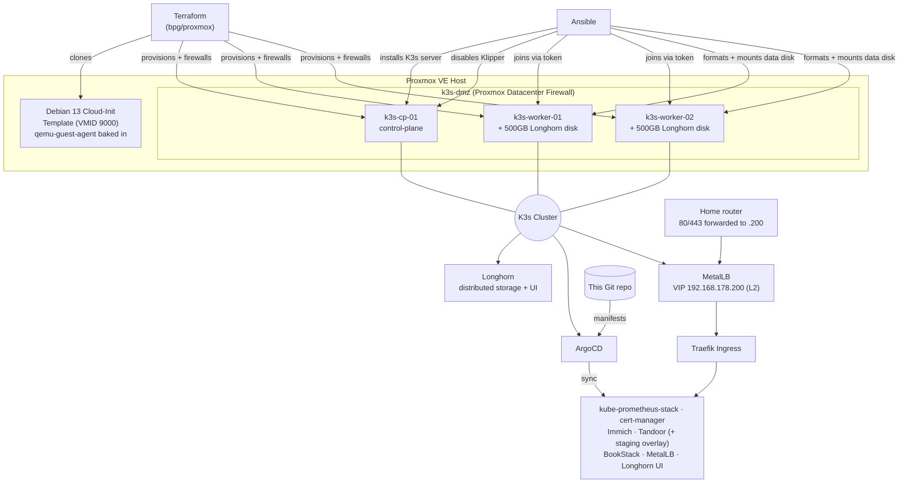

# Setup & Runbook

Full build log and replication guide for the homelab GitOps Kubernetes platform. See [`00-for-recruiters.md`](./00-for-recruiters.md) for the high-level pitch, and the root [`README.md`](../README.md) for the ongoing project roadmap.

This document reflects the actual build session end to end, including every bug that was hit and how it was fixed — replicating this from scratch should not require re-discovering any of them.

---

## Architecture



**Layers, bottom to top:**
1. **Terraform** (`terraform/proxmox/`) — provisions VMs on Proxmox via the `bpg/proxmox` provider, from a hand-built Cloud-Init template, and locks each VM's NIC into the `k3s-dmz` security group (`firewall.tf`).
2. **Ansible** (`ansible/playbooks/`) — installs K3s itself, disables K3s's built-in Klipper load balancer so MetalLB can take over, and prepares each worker's secondary disk for Longhorn.
3. **MetalLB** (L2 mode) — claims a floating VIP (`192.168.178.200`) for Traefik's Service, so the router's port-forward targets a VIP that survives node failure/rebalancing instead of one hardcoded node IP.
4. **ArgoCD** (`kubernetes/`) — takes over cluster state from here; every application is a Git-committed `Application` manifest. There's still no App-of-Apps parent (see [Known limitations](#known-limitations--whats-next)), so a brand new `Application` object always needs one manual `kubectl apply` the first time, same as every app before it.

The `k3s-dmz` security group (defined once, attached to all three VMs) allows SSH/6443 from the LAN and 80/443 from anywhere in, allows DNS/DHCP-to-gateway and full node-to-node mesh out, and drops everything else outbound to the rest of the LAN — the actual point being that a compromised app pod can't pivot sideways to the NAS, other PCs, or smart-home devices on the same network. Enforcement is inert until a one-time manual toggle at Datacenter → Firewall → Options in the Proxmox web UI (deliberately not Terraform-managed — see [bug 23](#bugs-hit-and-fixed)).

---

## Prerequisites

- A Proxmox VE host (this was built against 9.2.2) with API access
- Terraform >= 1.0
- **Ansible cannot run on native Windows** (it requires the Unix-only `fcntl` module). If your workstation is Windows, install Ansible inside WSL (`wsl --install`, then `sudo apt install ansible` inside the WSL distro) — this is what was used to build this.
- An SSH key pair for VM access
- `kubectl` (can also just be run from the K3s control-plane node itself, which K3s installs it on automatically)

---

## Step-by-step replication

### 1. Create a Proxmox API token

Datacenter → Permissions → API Tokens → Add. **Uncheck "Privilege Separation"** unless you plan to explicitly grant permissions afterward (see [Troubleshooting](#bugs-hit-and-fixed) below — a Privilege-Separated token silently returns empty lists instead of erroring, which is a confusing failure mode).

If you do use Privilege Separation, grant it at minimum:
`VM.Allocate`, `VM.Clone`, `VM.Config.*`, `VM.PowerMgmt`, `VM.Monitor`, `Datastore.Audit`, `Datastore.AllocateSpace` on path `/`.

### 2. Build the Cloud-Init template

Run **on the Proxmox host itself** (not from your workstation):

```bash
scp terraform/proxmox/create-cloudinit-template.sh root@<proxmox-host>:/root/
ssh root@<proxmox-host> 'bash /root/create-cloudinit-template.sh'
```

This downloads the Debian 13 (trixie) generic cloud image, uses `virt-customize` to bake in and enable `qemu-guest-agent` **before** the image is ever imported into Proxmox, then converts it to template VMID `9000`. See [why this step exists](#bugs-hit-and-fixed) below.

### 3. Configure Terraform

```bash
cd terraform/proxmox
cp terraform.tfvars.example terraform.tfvars
# edit terraform.tfvars: real API URL (include :8006!), token, node name, SSH key path
```

The `vms` map defines your cluster topology — one `control-plane` entry, N `worker` entries, each with its own `template_vm_id`, sizing, and optional `secondary_disk_size` for Longhorn (workers only).

If you have **pre-existing VMs on the same Proxmox host that Terraform should not manage**, do not add them to the `vms` map, and if they were ever imported into a previous state, remove them: `terraform state rm '<resource address>'` (this only edits local state — it does not touch the live VM).

### 4. Provision the VMs

```bash
terraform init
terraform plan   # review carefully - confirm 0 unexpected destroys
terraform apply
```

### 5. Bootstrap K3s

From WSL (or any Linux control node):

```bash
cd ansible
ansible-playbook -i inventories/production/hosts.ini playbooks/install-k3s.yml
```

This installs the K3s server on the control-plane, retrieves its join token, and joins both workers as agents. Verify:

```bash
ssh matt@<control-plane-ip> 'sudo kubectl get nodes'
```

### 6. Prepare Longhorn storage

```bash
ansible-playbook -i inventories/production/hosts.ini playbooks/setup-longhorn-nodes.yml
```

Two plays: iSCSI/NFS OS prerequisites go on **every** cluster node (`k3s_cluster`) including the control-plane - Longhorn's manager DaemonSet needs `iscsiadm` there too even though it holds no disk, see [bug 10](#bugs-hit-and-fixed) below. Only then does the second play format the secondary disk `ext4` and mount it at `/var/lib/longhorn` on the workers. The disk is identified **structurally** (the one block device with no partition table), not by a hardcoded device name — see [bug 5](#bugs-hit-and-fixed) below.

### 7. Bootstrap ArgoCD

```bash
scp kubernetes/bootstrap/install-argocd.sh matt@<control-plane-ip>:/tmp/
ssh matt@<control-plane-ip> 'sudo KUBECONFIG=/etc/rancher/k3s/k3s.yaml bash /tmp/install-argocd.sh'
```

Prints the initial admin password retrieval command at the end. Log in, then delete `argocd-initial-admin-secret` as recommended upstream.

### 8. Install Longhorn and deploy the first apps

```bash
# Longhorn itself (Helm)
helm repo add longhorn https://charts.longhorn.io && helm repo update
kubectl create namespace longhorn-system
helm install longhorn longhorn/longhorn \
  --namespace longhorn-system \
  --set defaultSettings.defaultDataPath="/var/lib/longhorn" \
  --set defaultSettings.createDefaultDiskLabeledNodes=true \
  --set persistence.defaultClassReplicaCount=<number of worker/storage nodes>
kubectl label nodes <worker-1> <worker-2> node.longhorn.io/create-default-disk=true
```

Set `persistence.defaultClassReplicaCount` to however many nodes actually have a Longhorn disk (2 in this build) - the chart's own default is 3, which silently deadlocks every volume if you have fewer storage nodes than that. See [bug 12](#bugs-hit-and-fixed) below.

Also reduce each disk's reserved buffer - Longhorn reserves ~30% of a disk by default, sized for disks *shared* with other workloads. Ours are 100% dedicated to Longhorn, so that reservation just wastes capacity and can block volumes from scheduling at all (see [bug 13](#bugs-hit-and-fixed)):

```bash
for n in <worker-1> <worker-2>; do
  disk=$(kubectl -n longhorn-system get nodes.longhorn.io "$n" -o jsonpath='{.spec.disks}' | python3 -c "import json,sys; print(list(json.load(sys.stdin).keys())[0])")
  kubectl -n longhorn-system patch nodes.longhorn.io "$n" --type=merge \
    -p "{\"spec\":{\"disks\":{\"$disk\":{\"storageReserved\":2147483648}}}}"   # 2GiB
done
```

```bash
# kube-prometheus-stack's CRDs live in Helm's special crds/ folder, which
# ArgoCD does not reliably manage even with ServerSideApply=true (see bug
# 11) - kubernetes/apps/kube-prometheus-stack.yaml already sets
# source.helm.skipCrds: true to opt out of ArgoCD managing them, so install
# them once yourself, version-matched to the pinned chart revision:
helm repo add prometheus-community https://prometheus-community.github.io/helm-charts
helm repo update
helm show crds prometheus-community/kube-prometheus-stack --version 65.5.1 \
  | kubectl apply --server-side -f -

# ArgoCD apps - first sync of each is a manual kubectl apply (no App-of-Apps yet)
kubectl apply -f kubernetes/apps/kube-prometheus-stack.yaml
kubectl apply -f kubernetes/apps/cert-manager.yaml
# wait for cert-manager to be Ready, THEN:
kubectl apply -f kubernetes/apps/cluster-issuers.yaml   # edit the email placeholder first
kubectl apply -f kubernetes/apps/immich-postgres.yaml     # standalone Postgres+Redis - see bugs 17/18 below
kubectl apply -f kubernetes/apps/immich.yaml               # edit domain + create the postgres secret first
kubectl apply -f kubernetes/apps/tandoor.yaml
kubectl apply -f kubernetes/apps/bookstack.yaml
```

Every one of these `.yaml` files has `TODO`-flagged placeholders (domains, the Let's Encrypt contact email, database secrets) — check each file before applying.

Access Grafana without any ingress/TLS setup at all, straight over a port-forward:

```bash
kubectl port-forward svc/kube-prometheus-stack-grafana 3000:80 -n monitoring
# http://localhost:3000, user: admin, password:
kubectl -n monitoring get secret kube-prometheus-stack-grafana -o jsonpath='{.data.admin-password}' | base64 -d
```

### 9. Firewall DMZ, MetalLB, Longhorn UI, and a staging overlay

Added to an already-running cluster (not part of a from-scratch bootstrap) - order matters here, more than in Step 8, because getting it wrong has real downtime/lockout consequences.

**9a. Disable Klipper before anything MetalLB-related:**

```bash
ansible-playbook -i ansible/inventories/production/hosts.ini ansible/playbooks/disable-klipper.yml
```

This is a real, if brief, outage: Traefik's Service has no external IP at all from the moment Klipper's `svclb-traefik` DaemonSet is torn down until MetalLB is deployed and assigns the new VIP. Do steps 9a-9c back to back, not spread across a day.

**9b. Apply the firewall - `terraform apply` creates the rules but they're inert:**

```bash
cd terraform/proxmox && terraform apply
```

The Proxmox-side rules exist after this but are not yet enforced - the cluster-wide "Firewall: Enabled" toggle at Datacenter → Firewall → Options in the Proxmox web UI is deliberately left as a manual step (`pvesh set /cluster/firewall/options --enable 1` is the CLI equivalent), specifically so enabling segmentation is never something a routine `terraform apply` could do by accident. **Immediately after flipping it, verify SSH still works before doing anything else.** If it doesn't, flip it back off - nothing in `firewall.tf` touches the Proxmox host itself, only the K3s guest VMs, so the host stays reachable regardless.

**9c. Push and register the new Applications, then repoint the router:**

```bash
git push origin main
# No App-of-Apps yet (see Known limitations) - each is a one-time manual apply:
for f in metallb metallb-config longhorn-ui tandoor-staging; do
  kubectl apply -f kubernetes/apps/$f.yaml
done
```

Once `metallb-config` is `Synced`/`Healthy`, `kubectl get svc -n kube-system traefik` shows the assigned VIP (`192.168.178.200` in this build) instead of Klipper's old multi-node-IP listing. Repoint the router's 80/443 port-forward at that VIP, not a specific node - that's the actual point of MetalLB here, since forwarding to one node IP is a single point of failure the router doesn't know how to fail over.

**9d. Seed the two new out-of-band secrets** (same pattern as every other app secret in this repo - see the Secret-related bugs below):

```bash
# Longhorn UI BasicAuth - the UI itself has zero built-in auth
htpasswd -nbB admin '<password>' > /tmp/lh-htpasswd    # or: openssl passwd -apr1 '<password>'
kubectl create secret generic longhorn-basic-auth -n longhorn-system --from-file=users=/tmp/lh-htpasswd

# tandoor-staging's own DB secret - fresh random values are correct here
# (unlike bug 21 below, this is a brand-new empty database, not one with
# existing data a fresh password would fail to authenticate against)
kubectl create secret generic tandoor-secrets -n tandoor-staging \
  --from-literal=SECRET_KEY="$(openssl rand -base64 48)" \
  --from-literal=POSTGRES_PASSWORD="$(openssl rand -base64 32)"
```

**9e. DNS** - add a CNAME for each new hostname (`longhorn.<domain>`, `staging-<app>.<domain>`) pointing at whatever your existing app subdomains already point at. cert-manager's HTTP-01 challenges for these sit in `pending` (not failed) until DNS resolves, and pick themselves back up automatically once it does - no manual retry needed.

**Staging's prod-data-sync workflow** (testing a risky DB migration against real data before it ever touches production) is documented in full inside `kubernetes/apps/manifests/tandoor-staging/kustomization.yaml`'s header comment. Short version: it is intentionally a manual, operator-triggered action - Longhorn volume-snapshot the prod PVC (or `pg_dump`/`pg_restore` via `kubectl exec` if cross-namespace snapshot cloning isn't set up), restore into staging's own PVC with staging scaled to 0, scale up, test, discard. There's no way to express "clone real prod data on demand" as a declarative GitOps desired-state, so this isn't automated and isn't meant to be.

---

## Bugs hit and fixed

Documented in detail because they're the actual engineering content of this build, not because anything went "wrong." In order encountered:

### 1. `terraform apply` hangs indefinitely on VM creation
**Cause:** the Debian cloud image does not ship `qemu-guest-agent`. The Terraform module sets `agent { enabled = true }`, so the provider waits (up to `agent.timeout`) for a guest-agent response that never comes.
**Fix:** `create-cloudinit-template.sh` now runs `virt-customize -a <image> --install qemu-guest-agent --run-command 'systemctl enable qemu-guest-agent'` on the image **before** it's imported into Proxmox — via `libguestfs-tools`, with `LIBGUESTFS_BACKEND=direct` (Proxmox hosts don't run `libvirtd` by default, which `virt-customize` otherwise tries first).

### 2. `terraform destroy` *also* hangs, on VMs from the broken template
**Cause:** Terraform refreshes state before any operation, including destroy — and that refresh hits the same non-responsive guest-agent problem for any resource with `agent.enabled = true`.
**Fix:** for VMs you don't need Terraform to gracefully tear down, skip the state refresh entirely: `terraform state rm '<address>'` (removes from state only), then delete the VM directly (`qm stop <vmid> && qm destroy <vmid> --purge` on the Proxmox host).

### 3. Proxmox API returns empty VM/storage lists despite VMs existing
**Cause:** an API token created with **Privilege Separation** enabled doesn't inherit the owning user's permissions and has none of its own by default. List-type endpoints (`/qemu`, `/lxc`, `/storage`) silently filter to empty instead of erroring; only a more specific endpoint (e.g. storage *content*) surfaces an explicit 403.
**Fix:** grant the token an explicit role (e.g. `Administrator`) on path `/` via Datacenter → Permissions → Add → API Token Permission, or recreate the token without Privilege Separation.

### 4. `terraform apply` fails on worker nodes only: `unsupported format 'qcow2'`
**Cause:** the module's secondary (Longhorn) disk block didn't set `file_format`. The provider's default for a freshly-created (non-cloned) disk is `qcow2`, but `local-lvm` (LVM-Thin) is block storage and only supports `raw`.
**Fix:** explicit `file_format = "raw"` on the secondary `disk` block in `modules/ubuntu-vm/main.tf`. The primary (cloned) disk was never affected — clones inherit their source's format.

### 5. Near-miss: `/dev/sdb` is the wrong disk on one worker
**Cause:** Linux device naming for multiple SCSI/virtio disks is not guaranteed to match attachment order across every boot. On one worker, the blank 50GB Longhorn disk enumerated as `/dev/sda` while the cloned, mounted **root** filesystem enumerated as `/dev/sdb` — the exact opposite of the other worker and of the hardcoded assumption in the first version of `setup-longhorn-nodes.yml`.
**What happened:** `mkfs.ext4`'s own safety check refused to format a disk it detected as in-use, with `/dev/sdb is apparently in use by the system; will not make a filesystem here!` — this is what prevented the root filesystem from being wiped. It was not a check written into the playbook; it was a lucky backstop from `mke2fs` itself.
**Fix:** the playbook no longer trusts a device name. It inspects `ansible_devices`, finds whichever `sdX` device has an **empty partition table**, and asserts that exactly one such candidate exists before doing anything — the cloned root disk always has partitions (from the template), a fresh Terraform-attached disk never does. Structural identification instead of positional assumption.

### 6. Ansible can't run on the Windows workstation at all
**Cause:** Ansible's control-node code depends on `fcntl`, a POSIX-only Python stdlib module with no Windows equivalent — no `pip install` fixes this.
**Fix:** ran Ansible from WSL (Windows Subsystem for Linux) instead, with the SSH private key copied into WSL's native filesystem (not accessed via `/mnt/c/...`, which has Windows-permissive file permissions that OpenSSH refuses for a private key — `chmod 600` inside WSL's own filesystem fixes this).

### 7. Ansible fails with `Attempting to decrypt but no vault secrets found`
**Cause:** running `ansible-playbook` from inside the `ansible/` directory causes Ansible to auto-discover and try to decrypt `group_vars/all/vault.yml` — which belongs to this repo's separate Docker/reverse-proxy track and has nothing to do with the K3s inventory being run, but is still unconditionally loaded for any host in group `all`.
**Fix:** run `ansible-playbook` from a working directory outside the `ansible/` tree, passing full paths to both the inventory and the playbook — this avoids the cwd-relative `group_vars/` auto-discovery that pulls in the unrelated vault file.

### 8. ArgoCD install fails: CRD annotation too large
**Cause:** a plain `kubectl apply -f <upstream ArgoCD manifests>` stores the entire object as a `last-applied-configuration` annotation for future 3-way merges. ArgoCD's `applicationsets.argoproj.io` CRD has a large enough OpenAPI schema to exceed Kubernetes' 256KiB (262144 byte) annotation size limit.
**Fix:** `kubectl apply --server-side` — server-side apply has the API server compute the diff instead of relying on a client-stored annotation, so the size limit doesn't apply.

### 9. Re-running the (now server-side) apply hits field-manager conflicts
**Cause:** the first, partially-failed run had already created most objects via client-side apply, registering `kubectl-client-side-apply` as their field manager. The second, server-side run then conflicted with that ownership on fields already set.
**Fix:** added `--force-conflicts` — safe here since nothing else manages these fields; documented in the [Kubernetes server-side apply docs](https://kubernetes.io/docs/reference/using-api/server-side-apply/#conflicts).

### 10. `longhorn-manager` CrashLoopBackOff on the control-plane
**Cause:** Longhorn's manager runs as a DaemonSet on *every* cluster node, including the control-plane - even though the control-plane holds no Longhorn disk by design (see Terraform's `secondary_disk_size`, worker-only). `setup-longhorn-nodes.yml` originally only targeted `workers`, so the control-plane never got `open-iscsi` installed. The manager's own startup check fails hard without it: `Error starting manager: failed to check environment, please make sure you have iscsiadm/open-iscsi installed on the host`.
**Fix:** split the playbook into two plays - iSCSI/NFS OS prerequisites now run against `k3s_cluster` (all nodes), while the disk format/mount logic stays `workers`-only.

### 11. ArgoCD sync fails on kube-prometheus-stack: same CRD-annotation-size problem, in a new place
**Cause:** ArgoCD's Helm rendering *does* attempt to apply CRDs from a chart's special `crds/` folder (it isn't skipped outright), but does so in a way that hits the identical 256KiB annotation limit from bug 8/9 - and unlike ArgoCD's own bootstrap, setting `syncOptions: [ServerSideApply=true]` at the Application level did **not** fix it here; the same "Too long" error kept recurring across multiple sync retries.
**Fix:** `source.helm.skipCrds: true` on the Application, so ArgoCD doesn't touch these CRDs at all - install them once yourself, version-matched to the pinned chart revision: `helm show crds prometheus-community/kube-prometheus-stack --version <rev> | kubectl apply --server-side -f -`. After changing this on an Application that's already stuck retrying, a `kubectl delete -f` + `kubectl apply -f` (full recreate) was needed - a `refresh=hard` annotation and even clearing `status.operationState` were not enough to unstick the retry loop.

### 12. Prometheus/Alertmanager/Grafana volumes stuck `degraded`/`faulted`: replica count vs. actual storage nodes
**Cause:** the `longhorn` StorageClass's chart default is `numberOfReplicas: "3"`, but only 2 nodes in this cluster actually have a Longhorn disk (the control-plane deliberately has none). A 3rd replica can never be scheduled, so every volume sits permanently `degraded` - or, if it never got even one replica placed before something else went wrong, `faulted` and stuck `detached`.
**Fix:** `helm upgrade longhorn longhorn/longhorn --reuse-values --set persistence.defaultClassReplicaCount=2` fixes it for *new* volumes (`StorageClass.parameters` is immutable, so this recreates the class rather than patching it). Volumes already created against the old 3-replica class needed a direct, live patch - Longhorn supports changing replica count on an existing volume without recreating it: `kubectl -n longhorn-system patch volumes.longhorn.io <name> --type=merge -p '{"spec":{"numberOfReplicas":2}}'`.

### 13. A volume still won't schedule even at the correct replica count: `insufficient storage`
**Cause:** Longhorn reserves roughly 30% of every disk as unusable buffer by default (`storageReserved` on the node's disk spec) - sensible on a disk shared with other workloads, but our secondary disk exists *solely* for Longhorn. After Grafana's and Alertmanager's replicas were already scheduled, the remaining "usable" space (post-reservation) on a 50GB disk was just under Prometheus's 20Gi request.
**Fix:** reduced the reservation to a flat 2GiB per disk: `kubectl -n longhorn-system patch nodes.longhorn.io <node> --type=merge -p '{"spec":{"disks":{"<disk-name>":{"storageReserved":2147483648}}}}'`.

### 14. Deleting and recreating a stuck PVC deadlocks with itself
**Cause:** while recovering from bug 12/13, a faulted Prometheus PVC was deleted so the StatefulSet would recreate it fresh. Kubernetes' built-in `kubernetes.io/pvc-protection` finalizer blocks a PVC's deletion until no Pod references it - but the StatefulSet immediately created a *new* pod requesting a PVC with the exact same name, which then itself became the reference blocking the old PVC's finalizer from clearing. Neither side could proceed.
**Fix:** delete the new pod too (`--force --grace-period=0`) to drop the reference, let the finalizer clear and the old PVC fully disappear, and only then does the StatefulSet's next pod get a genuinely new PVC bound against the (by-then-corrected) StorageClass.

### 15. A routine memory bump plans to destroy and recreate all 3 VMs
**Cause:** `ssh_keys = [file(var.ssh_public_key_path)]` in `main.tf` reads the key file byte-for-byte. At some point the file's trailing newline no longer matched what was captured in state, and `user_account.keys` is only appliable at clone time - so Terraform planned a full destroy+recreate of every VM (including their Longhorn disks) just to change a value that looked character-for-character identical when printed.
**Fix:** wrap it in `trimspace()`: `ssh_keys = [trimspace(file(var.ssh_public_key_path))]`. This was latent and would have bitten the *next* `terraform apply` regardless of what it changed - not specific to the memory change that surfaced it.

### 16. Resizing a live-attached disk reshuffles device names mid-session
**Cause:** growing a worker's secondary disk via `terraform apply` (`secondary_disk_size: 50 -> 500`) caused the guest kernel to re-enumerate its SCSI devices on that one worker - `/dev/sda` and `/dev/sdb` swapped roles between the disk being resized and the (unrelated) root disk, *while the system stayed running*. This is the same non-deterministic-naming issue as bug 5, but this time triggered by a live hardware change instead of a boot, and `/etc/fstab` (written with a device path, not a UUID) silently mounted nothing at `/var/lib/longhorn` on restart of the mount (`nofail` swallows the error).
**What happened:** Longhorn's own UUID check caught it - `record diskUUID doesn't match the one on the disk` - and marked the disk `Ready: False` rather than accepting the wrong filesystem. Several volumes went `degraded` (one remaining good replica) until the disk was fixed and Longhorn rebuilt the missing replica.
**Fix:** stop using device paths in `/etc/fstab` entirely. Resolve the filesystem's UUID (`blkid -s UUID -o value /dev/sdX`) and mount by `UUID=...` instead, on both workers - immune to enumeration order changing again for any reason.

### 17. Immich's bundled Postgres subchart doesn't just warn, it refuses to render
**Cause:** `postgresql.enabled: true` on the immich-charts chart is deprecated - but unlike a normal deprecation, the chart's `checks.yaml` template contains a hard `fail`, so `helm template` errors out completely (ArgoCD shows `ComparisonError`, not a warning) the moment that flag is set. See [immich-charts#149](https://github.com/immich-app/immich-charts/issues/149).
**Fix:** `postgresql.enabled` left at its default (`false`, i.e. the whole `postgresql:` block removed from values), and a standalone Postgres deployed instead - same `tensorchord/pgvecto-rs` pgvector-capable image the deprecated subchart used, as plain `StatefulSet` + `PVC` + `Service` manifests (`kubernetes/apps/manifests/immich-postgres/postgres.yaml`), with the required `cube`/`earthdistance`/`vectors` extensions created via a mounted `/docker-entrypoint-initdb.d` init script. Immich's shared `env.DB_HOSTNAME` etc. point at it; `DB_PASSWORD` arrives via `server.envFrom.secretRef` rather than being inlined in values.

### 18. Immich's bundled Redis subchart: image tag doesn't exist
**Cause:** the chart's `redis` subchart pulls `docker.io/bitnami/redis:7.2.5-debian-12-r0`, which Docker Hub returns `not found` for - Bitnami removed a large number of free-tier image tags in 2025 while moving to a paid "Secure Images" model. This breaks any chart still pinned to an affected tag, not something specific to this repo.
**Fix:** same pattern as Postgres - `redis.enabled` left at its default `false`, and a plain `redis:7-alpine` `StatefulSet` + `Service` deployed standalone (same manifests directory as the Postgres fix above), with `env.REDIS_HOSTNAME` pointed at it.

### 19. A GitOps Application can reference files that were never pushed
**Cause:** `kubernetes/apps/immich-postgres.yaml` was created and applied locally, but its `source.repoURL` points at GitHub, not the local filesystem - ArgoCD's own copy of the repo didn't have the new `manifests/immich-postgres/` directory yet, so the Application sat in `Unknown` sync status with `app path does not exist` until the commit was actually pushed.
**Not really a bug** - a reminder that with a git-hosted `source`, "I wrote the file" and "ArgoCD can see the file" are two different things. `kubectl apply`-ing an Application manifest only registers *that ArgoCD should watch a path* - it doesn't substitute for pushing what's supposed to be at that path.

### 20. A `secretRef` in `envFrom` silently loses to a chart's own default env value
**Cause:** the immich-charts chart's own default `values.yaml` already defines `env.DB_PASSWORD` as a template string (falling back to the literal placeholder `"immich"` once the deprecated postgres subchart's values were removed). Kubernetes resolves a container's `env` list and `envFrom` sources independently, and for a duplicate key, a plain `env` entry always wins over anything injected via `envFrom` - so `server.envFrom: [{secretRef: {name: immich-postgres-secret}}]` compiled correctly, but its `DB_PASSWORD` was silently shadowed by the chart's own baked-in one. Immich's actual Postgres password never matched what the server tried to authenticate with. `kubectl get pod ... -o jsonpath='{.spec.containers[0].env}'` was what surfaced it - the container's *rendered* env list showed the literal string `"immich"`, not a secret reference.
**Fix:** override the exact same `env.DB_PASSWORD` values path directly (not via `envFrom`), using the chart's support for structured env entries: `env.DB_PASSWORD.valueFrom.secretKeyRef`. Setting a value at the identical path a chart default occupies replaces it outright during the Helm values merge, instead of trying to out-compete it at the Kubernetes container-spec level.

### 21. `prune: true` deletes a Secret the moment it's removed from git - even ones with real data
**Cause:** `tandoor.yaml`/`bookstack.yaml` originally defined their Secret objects inline (with `CHANGE-ME` placeholders) and were pushed to git in an earlier session, so ArgoCD's first-ever sync created and *took ownership of* those Secrets. Later in this session the Secret blocks were removed from the manifests (in favor of creating them out-of-band, matching immich's pattern) - but the already-running Postgres/MariaDB pods still had the old placeholder credentials baked into their environment (and, for the databases, into their actual user tables on disk). The moment the removal was pushed and ArgoCD resynced, `prune: true` correctly saw "this Secret is no longer declared in git" and deleted it - taking down every *new* pod that needed it (already-running pods kept working, since env vars are injected once at container start and don't change when the Secret disappears later).
**Fix:** recovered the actual in-use values from the still-running pods' live environment (`kubectl exec <pod> -- env`) and recreated the Secrets with those exact values - a fresh random password would have been rejected by the already-initialized database. Lesson for next time: moving a resource from git-managed to out-of-band is not a no-op if ArgoCD already owns a version of it with real, live-depended-upon data - recreate it with matching values *before* or immediately as part of the same push that stops declaring it, not after.

### 22. Every rollout of a single-replica app on a ReadWriteOnce volume deadlocks
**Cause:** `Deployment`'s default `RollingUpdate` strategy schedules the new pod before terminating the old one. With `replicas: 1` and the app's PVCs mode `ReadWriteOnce`, the new pod can never actually start - `Multi-Attach error for volume ...: Volume is already used by pod(s) <old-pod>` - and since Kubernetes won't kill the old pod until the new one is Ready, neither side can proceed without manual intervention (delete the stuck new pod). This applies to Tandoor and BookStack; it would apply to any future single-replica app with RWO storage added the same way.
**Fix:** `strategy: {type: Recreate}` on both Deployments - explicitly stop the old pod (and release its volumes) before starting the new one, trading a few seconds of downtime per rollout for a rollout that doesn't hang.

### 23. Proxmox VM-level firewall rules exist but do nothing until a cluster-wide switch is flipped
**Cause:** `network_device.firewall = true` plus a security group's rules only arms a VM's NIC to *evaluate* rules - Proxmox's Datacenter-level "Firewall: Enabled" option is a separate, global on/off switch, and until it's on, every VM-level rule is inert regardless of how correctly it's written.
**Not a bug so much as a deliberate design choice worth documenting:** `firewall.tf` intentionally does not manage that Datacenter-level toggle as a Terraform resource, specifically so enabling segmentation is always a conscious, single, reversible-by-checkbox action (`pvesh set /cluster/firewall/options --enable 1`) - never something a routine `terraform apply` could silently re-enable after someone turned it off mid-incident to regain SSH access. See Step 9b above for the actual rollout order this implies.

### 24. MetalLB's `bgppeers` CRD gets misdiagnosed, then correctly diagnosed, as the same CRD-annotation-size bug
**Cause:** after `terraform apply` + first ArgoCD sync, the `metallb` Application reported "successfully synced" but stayed permanently `OutOfSync` on exactly one resource: the `bgppeers.metallb.io` CRD. Pattern-matched this immediately to [bug 11](#bugs-hit-and-fixed)'s 256KiB last-applied-configuration annotation problem and applied the same fix (`skipCrds: true` + manual `helm show crds | kubectl apply --server-side`) - except `helm show crds metallb/metallb` returned nothing. MetalLB's chart doesn't ship CRDs via Helm's special `crds/` folder at all (confirmed with `helm template --include-crds`, which does show all 7 CRDs as regular templates) - `skipCrds` was a silent no-op for this chart, and the fix was reverted before ever being real.
**What it actually was:** the CRD's `kubectl.kubernetes.io/last-applied-configuration` annotation from the very first (pre-`ServerSideApply`) sync was still present, confusing later diffs even after `ServerSideApply=true` was added. Stripping it (`kubectl annotate crd bgppeers.metallb.io kubectl.kubernetes.io/last-applied-configuration-`) didn't fully resolve it either.
**Current state, left as-is:** the `metallb` Application still shows `OutOfSync` on this one CRD. It's cosmetic - confirmed live that MetalLB's controller and all 3 speaker pods run fine, and Traefik's Service correctly receives its VIP and serves real HTTPS traffic through it (`curl` returned a valid TLS handshake + expected HTTP response through the VIP). `BGPPeer` specifically is unused in this build (L2 mode only, no BGP peering configured), so a permanently-stale diff on that one CRD was judged not worth more time chasing versus what it would take to actually root-cause it.

### 25. ArgoCD's kustomize build rejects `../` resource references by default
**Cause:** the first draft of the Tandoor staging overlay referenced production's manifest directly (`resources: - ../tandoor/tandoor.yaml`), the obvious DRY choice for a base+overlay layout. Both `kubectl kustomize` (tested locally before ever pushing) and ArgoCD's own kustomize build enforce `LoadRestrictionsRootOnly` by default - any resource path resolving outside the kustomization's own root directory is rejected (`file ... is not in or below ...: must build at directory`), even for a same-repo sibling directory. Fixing it "properly" means setting `kustomize.buildOptions: "--load-restrictor LoadRestrictionsNone"` in the shared `argocd-cm` ConfigMap - a cluster-wide change affecting every other Application's kustomize behavior, not something scoped to just this one overlay.
**Fix:** made the staging overlay self-contained instead - `kubernetes/apps/manifests/tandoor-staging/base-resources.yaml` is a deliberate copy of prod's resources, not a live reference, at the cost of needing a manual re-copy if prod's resource *shapes* (not just config values) ever change. Caught locally via `kubectl kustomize <dir>` before it ever reached ArgoCD - worth running that as a sanity check on any new kustomize overlay before pushing.

### 26. Longhorn's admission webhook rejects creating a `Setting` object that doesn't already exist
**Cause:** `kubernetes/apps/manifests/longhorn-ui/backup-target.yaml` declares two raw `Setting` custom resources (`backup-target`, `backup-target-credential-secret`) as the documented live-update mechanism for a Longhorn instance that was installed out-of-band via `helm install` (so a `defaultSettings.backupTarget` Helm value can't retroactively change it). Longhorn's `mutator.longhorn.io` admission webhook rejected the sync outright: `setting backup-target does not exist`. Longhorn apparently creates `Setting` objects lazily, only for settings actually touched through its own UI/API/controller at least once - not pre-seeded for every possible setting name - so a plain external `kubectl apply`/create for a name it hasn't seen yet is rejected rather than treated as a normal upsert.
**Current state, left as-is:** this Application will keep retrying and failing on that same admission error until a backup target is configured once through the Longhorn UI (reachable via `longhorn-ui.yaml` in the same directory) or its API, which is what actually makes the `Setting` object exist server-side. Documented as a real, unresolved limitation rather than pretending the manifest already works - there's no backup target (NFS share or S3 bucket) provisioned anywhere in this stack yet either, so this was never going to fully succeed on this pass regardless.

### 27. A secret piped from Windows through SSH picks up a UTF-8 BOM, silently breaking auth
**Cause:** generating the Longhorn UI's htpasswd secret involved `Get-Content $file | ssh ... "cat > /tmp/htpasswd"` from a Windows/PowerShell control machine - PowerShell's pipeline-to-native-process encoding prepended a UTF-8 byte-order-mark (``) to the piped content. The resulting secret's first line was `<BOM>admin:$apr1$...` instead of `admin:$apr1$...`, which Traefik's BasicAuth middleware parses as a non-matching username - every login attempt returned `401`, with no error indicating why, including with the *correct* credentials.
**Fix:** stopped shelling text between Windows and Linux hosts entirely for anything security-sensitive - generate the htpasswd line and write the file in a single remote SSH session (`ssh host 'HASH=$(openssl passwd -apr1 "...") ; echo "admin:$HASH" > /tmp/htpasswd; kubectl create secret ...'`) instead. `od -c` on the decoded secret is a fast way to catch this class of invisible-character bug in general - a plain `cat`/`echo` won't show a BOM at all.

### 28. "It works from outside, not from inside" wasn't the network - it was the browser's own DNS cache
**Cause:** immediately after adding a new CNAME record, `longhorn.matt-host.de` failed to resolve via this machine's default (router-forwarded) DNS resolver, but resolved fine when queried directly against a public resolver (`8.8.8.8`/`1.1.1.1`) - a stale *negative* cache entry on the FRITZ!Box from before the record existed, which cleared on its own after a few minutes (DNS negative-caching TTL). Site symptom looked identical to a router NAT-hairpinning problem (works from the internet, not from the LAN) and was initially investigated as one (checked IPv6 AAAA routing, tested from a second LAN host via SSH) before the real cause became obvious. Then, even after the router's cache cleared and `curl` from the affected machine succeeded, the browser (including a fresh incognito window) still failed - Chrome/Edge keep their own internal DNS cache independent of the OS resolver, which an incognito window does not necessarily reset since it shares the same underlying browser process/network service.
**Fix:** no cluster/network/DNS change was actually needed. A full browser restart (not just a new incognito window) resolved it. `curl` succeeding from the same machine where the browser fails is the fast way to confirm the problem is client-side, not server-side, before investigating anything on the cluster or router.

### 29. BookStack's newer image build no longer templates `DB_HOST`/`DB_USER`/etc. into its `.env` file
**Cause:** `wiki.matt-host.de` started returning `502`. The `bookstack` pod had been recreated ~an hour earlier - collateral churn from the day's other node-level changes, not something deliberately triggered - and pulled a newer `lscr.io/linuxserver/bookstack:latest` build. Two compounding issues surfaced in sequence:
  1. **The new build halts entirely if `APP_KEY` isn't set** (`The application key is missing, halting init!`) - the pod reports `Running`, but nothing ever binds to port 80, so every connection fails (`502` at the edge, connection refused straight to the ClusterIP). `bookstack.yaml` never set `APP_KEY` because older builds auto-generated one on first run. Fixed by generating one (`base64:$(openssl rand -base64 32)`, Laravel's expected format) into `bookstack-secrets` and adding it to the Deployment's `env`.
  2. **That alone wasn't enough.** With `APP_KEY` fixed, the container started, but every DB query failed authenticating as the literal placeholder user `database_username` - the app was reading `/config/www/.env`, which turned out to still be nothing but the stock unmodified template (`DB_HOST=localhost`, `DB_USERNAME=database_username`, etc.), despite the container's real environment variables (`DB_HOST=bookstack-db`, `DB_USER=bookstack`, ...) being correctly present (`kubectl exec ... printenv` confirmed this). **This build's entrypoint no longer performs `DB_HOST`/`DB_USER`/etc. → `.env` substitution at all** - the `.env` that had worked for 36+ hours was templated once by an *older* image version and had simply been sitting untouched on the persistent `/config` volume ever since; the moment the missing-`APP_KEY` halt (issue 1) interrupted a fresh container's init sequence before that PVC ever got a properly-templated file, there was nothing correct left to fall back to.
**What made this worse mid-diagnosis:** deleting the broken `.env` to force regeneration (reasonable given it held zero real data) did NOT get it re-templated on the next start either - confirming issue 2 is not a first-run-only quirk but the build's new steady-state behavior. Recovered by writing the correct file directly (`kubectl cp`) with Laravel-native key names (`DB_USERNAME`/`DB_PASSWORD`, not this image's own advertised `DB_USER`/`DB_PASS`), then restarting the pod so PHP actually re-reads it (Laravel/PHP-FPM don't pick up an on-disk `.env` change on an already-running process).
**Not fully closed:** `bookstack.yaml`'s `DB_HOST`/`DB_USER`/`DB_PASS` env vars are now cosmetic - kept for documentation/continuity, but they don't do anything with this image build. If `/config/www/.env` is ever lost again (a PVC reset, another image update with the same behavior), this will recur and need the same manual fix. The durable fix would be mounting `.env` itself from a Secret (a `subPath` volume mount overlaying `/config/www/.env`) so it no longer depends on the image's own init behavior at all - flagged as a follow-up, not made live during the incident itself given the risk of an untested change compounding an active outage.
**Lesson for next time:** a `Running` pod with `1/1 Ready` is not the same claim as "this container is actually serving requests" - both failure modes here looked identical from `kubectl get pods`, and both only revealed themselves through `kubectl logs` and a direct connection test against the ClusterIP.

### 30. Bootstrapping a self-referencing App-of-Apps root triggers its own selfHeal loop
**Cause:** `root-app.yaml` (the new App-of-Apps root - see [Enterprise GitOps upgrade](#enterprise-gitops--security-upgrade-2026-08-29) below) was first written with an explicit `source.directory: {recurse: false}` - spelling out the default in the name of self-documentation. After bootstrapping with `kubectl apply`, the Application immediately went `OutOfSync` and stayed that way, with `metadata.generation` climbing on every reconcile (visible via `kubectl get application root-app -o jsonpath='{.metadata.generation}'` ticking up roughly every 3 minutes) - a live selfHeal loop, not a one-time diff. ArgoCD's live object never showed a `directory:` key under `spec.source` at all, even seconds after a sync reported success - it normalizes an explicit all-default `directory` block back to an absent key server-side, which then permanently disagreed with git having it present, so every reconcile re-patched it back in, disagreed again next comparison, and repeated forever.
**Fix:** removed the `directory:` key entirely (non-recursive is the field's own default when absent, so behavior is identical) and kept the reasoning as a plain comment instead of a literal field. Confirmed fixed by watching `metadata.generation` stop climbing and `status.sync.status` settle to `Synced` after a hard refresh.
**Lesson for next time:** don't spell out a default value on an ArgoCD `Application` source just for self-documentation if there's any chance the controller normalizes that field's zero-value differently than "absent" - diff this kind of thing live (`kubectl get application <name> -o jsonpath='{.metadata.generation}'` polled a couple of times) before considering a new Application actually settled, not just "reported Synced once."

### 31. Sealed Secrets refuses to adopt a pre-existing plain Secret with the same name, and a stalled retry doesn't self-resolve
**Cause:** migrating `longhorn-basic-auth` and `tandoor-secrets` to Sealed Secrets (see [Enterprise GitOps upgrade](#enterprise-gitops--security-upgrade-2026-08-29) below) meant introducing a `SealedSecret` with the same name/namespace as a Secret that already existed out-of-band. The controller correctly refused: `failed update: Resource "tandoor-secrets" already exists and is not managed by SealedSecret` - a deliberate safety check against silently overwriting an unrelated Secret that happens to share a name. This is NOT the bug 21 scenario (a real value getting reverted to a placeholder) - the sealed value here was resealed from the live Secret's own current data moments before, so the target state is byte-identical to what's already running; the only question was how to get the controller to actually take ownership.
**What made this take longer than expected:** deleting the blocking plain Secret was the right first step, but it wasn't sufficient on its own for `tandoor-secrets` - the controller logged `update suppressed, no changes in spec` on every subsequent reconcile, because it caches "already processed this spec" independently of whether the target Secret still exists, and won't re-verify that on a plain annotation nudge either. (`longhorn-basic-auth` in the same batch resolved on its own after the Secret deletion, seemingly because ArgoCD's sync happened to touch the SealedSecret object at the right moment - inconsistent enough not to rely on.)
**Fix:** delete the plain Secret, THEN delete the `SealedSecret` object itself and let ArgoCD's selfHeal recreate it from git - a genuinely fresh create event leaves the controller nothing to suppress. Verified zero pod restarts on both `tandoor` and `tandoor-postgres` throughout (env vars were already injected at container start, unaffected by the brief absence of the Secret object), and confirmed both apps still served real traffic correctly afterward (`tandoor.matt-host.de` → 302, `longhorn.matt-host.de` → 401 with no Authorization header, both expected).
**Lesson for next time:** when handing an existing out-of-band Secret over to Sealed Secrets, expect the takeover to need `kubectl delete secret <name>` *and* `kubectl delete sealedsecret <name>` (not just one), and confirm via `kubectl logs -n kube-system deploy/sealed-secrets-controller` rather than trusting an ArgoCD `Synced` status alone - Argo considers the SealedSecret resource itself synced regardless of whether the controller actually managed to unseal it into a live Secret.

---

## Enterprise GitOps & Security Upgrade (2026-08-29)

Four epics executed autonomously in one session while Matthias was away from the keyboard; each closes an item from the "Known limitations" list below. All four were verified live, not just committed - see bugs 30-31 above for the two real issues hit along the way.

1. **App-of-Apps** (`kubernetes/apps/root-app.yaml`) - the one remaining manual `kubectl apply` this repo should need for a brand-new top-level app. Verified live: pushing `sealed-secrets.yaml` and `ntfy-alertmanager.yaml` to git got both auto-registered with zero manual `kubectl apply`, the first real test of the whole point of this epic.
2. **CI validation** (`.github/workflows/validate-gitops.yml`, `.yamllint.yml`) - yamllint, `kubectl kustomize` against every overlay, and kubeconform schema validation against every raw manifest directory, on every push/PR to `main`.
3. **Sealed Secrets** (`kubernetes/apps/sealed-secrets.yaml`) - Bitnami's chart moved from `bitnami-labs.github.io/sealed-secrets` (404) to `bitnami.github.io/sealed-secrets` recently; the repo add step needed the new URL. `longhorn-basic-auth` and `tandoor-secrets` are migrated (see bug 31); Immich's and BookStack's secrets are not yet.
4. **Alertmanager → ntfy.sh** (`kubernetes/apps/ntfy-alertmanager.yaml`, `kube-prometheus-stack.yaml`'s new `alertmanager.config`) - Alertmanager's `webhook_configs` has no templating and can't reshape its fixed JSON schema into ntfy's title/priority/tags fields, so a small bridge (`xenrox/ntfy-alertmanager`, scfg-configured) sits in between. The bridge's config file holds the ntfy.sh topic name - a bearer credential on a public server, and this repo is public - so it's a `SealedSecret`, not a plain `ConfigMap` (a deviation from this epic's original ask, which assumed a Helm values change alone would be enough).

   **ntfy.sh topic: `matt-homelab-alerts-312f3c31681a`** — subscribe to this in the ntfy Android/iOS app (or at `https://ntfy.sh/matt-homelab-alerts-312f3c31681a` in a browser) to receive Alertmanager alerts. Verified end-to-end with a synthetic `firing` webhook POSTed directly to the bridge from inside the cluster - it arrived at ntfy.sh with the correct title, `priority: 3`, and `tags: ["warning"]` for a `severity: warning` label, confirming the whole pipeline (Alertmanager → bridge → ntfy.sh) actually works, not just that the manifests applied cleanly.

---

## Known limitations / what's next

Tracked as an ongoing checklist in the root [`README.md`](../README.md#phase-6-production-hardening--gitops-maturity-next-steps) (Phase 6). Ingress/TLS routing is resolved (cert-manager + Let's Encrypt, all live domains), the earlier single-node-forward SPOF (MetalLB VIP), App-of-Apps, CI validation, and Alertmanager receivers are now resolved (see the Enterprise GitOps upgrade above). Still genuinely open:

- **Longhorn backup target** — genuinely unresolved, not just unconfigured: no NFS share or S3 bucket exists anywhere in this stack yet (NAS arriving in 1-2 weeks as of 2026-08-29), and even once one does, Longhorn's admission webhook requires configuring it once through the UI/API before the GitOps-managed `Setting` resources in `longhorn-ui.yaml` can take over (bug 26).
- **Remote Terraform state** — still local, still a single point of failure for the state file itself. Reasonable to revisit once the NAS exists (it's a plausible backend target), not particularly valuable to solve before then.
- **GitOps secrets management is partial** — Longhorn UI's BasicAuth and Tandoor's DB credentials are migrated to Sealed Secrets (2026-08-29). Immich's Postgres password and BookStack's DB secrets are still created out-of-band by hand.
- **`bgppeers.metallb.io`'s perpetual OutOfSync** (bug 24) — cosmetic, not blocking, but still an open item if anyone wants to actually root-cause it rather than accept the current explanation.
- **BookStack's `.env` is a manually-patched file sitting on a PVC, not something GitOps manages** (bug 29) — if it's ever lost, the fix has to be repeated by hand. Mounting it from a Secret instead would close this properly.
- **Terraform/Ansible linting is not in CI** — the new pipeline covers Kubernetes manifests only; `terraform validate` and `ansible-lint` on push are still unaddressed.
- **ntfy.sh topic has no authentication beyond obscurity, and that obscurity is now partly spent** — the topic name is sealed (encrypted-at-rest) everywhere it lives as a Kubernetes manifest, but it's printed in plaintext just above in this same file, which is committed to a **public** GitHub repo, per the explicit ask to document it here. Anyone who reads this file can subscribe to or publish fake alerts to that topic. Acceptable for a homelab (worst case: spam notifications or a missed real alert, not a security breach of the cluster itself), but worth knowing this isn't actually secret once documented like this. Rotating to a fresh topic (and not writing the new one into a public file) would close this properly; ntfy's access-token auth is the real fix if it ever matters more than that.
